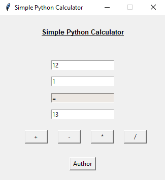

# Simple Calculator with Python

# Details
<ul>
<li> Able to perform addition, subtraction, multiplication and division only for two numbers </li>
<li> This program works on both Windows/Linux operating systems with Python versions 3.x </li>
<li> Run program using 'python calculator.py' in command line </li>
<li> Tkinter module was used for the GUI </li>
</ul>
